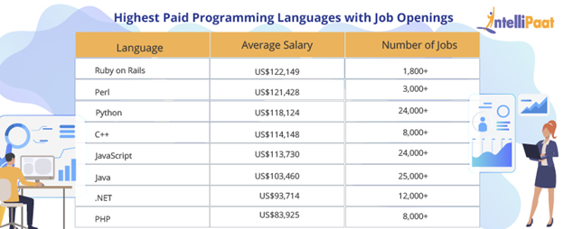
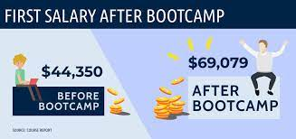

# **Predicting FinTech Bootcamp Graduate Salaries**

```
Project 2 - Group C
Presentation Date: January 15, 2022
Prepared by: Andrew Crawford, Margee Lancaster Rachel Pierce, Jinhyeong Park
```

#

## Project Title:
Predicting FinTech Bootcamp Graduate Salaries  



#

## Project Team Members:
- Andrew Crawford
- Margee Lancaster
- Rachel Pierce
- Jinhyeong Park

#

## Project Objective and Hypothesis  
  
Our objective was to research and learn what salaries are possible with skills obtained in this FinTech Bootcamp.  We used the Monster India API to retrieve data regarding job descriptions, skills, and salaries to determine the following:  
- What jobs require skills from this bootcamp?  
- What are the potential jobs and salaries for graduates with these skills?  
- Can we predict an accurate salary range based on these skills?  

Our hypothesis is that the more key skills you possess, the higher the salary.  
    


#

## Brief Background of Key Skills:
As part of the U of MN FinTech Bootcamp, we have obtained the necessary skills to automate and improve financial services using cutting-edge technology.  Skills gained at the conclusion of Bootcamp include the following:   
  

  
We selected key skills from this course to use in our analysis.
#

## Datasets Used:
We used data obtained from the Monster India API.
- https://crawlfeeds.com/datasets/monster-india-jobs-dataset    
  
We selected the following skills obtained during this FinTech Bootcamp to use in our model:
1. Database
2. Python
3. API
4. Algorithm
5. Cloud
6. Forecast
7. Big data
8. Dashboard
9. Project Management

We also used like-terms in our model to capture these skills using various terminology.  


#

##  Data Phases:
Our process consisted of data exploration,  data preparation, and data cleanup. 
  
- *Data Exploration:* Google seaches, API searches, Monster India API, FinTech Bootcamp Curriculum  
- *Data Preparation:* Searching through variables in Spyder, selecting key data, narrowing down jobs, determining key skills
- *Data Cleanup:* Dropping unnecessary information, searching the data to find jobs that include at least one key skill
  
Data Issues: 
- Issues include salaries in Indian rupees, not USD, so conversion was necessary
- Determining like-words for key skills, may not capture all 
- As shown in the graph below, the most broad salary range includes at least one skill.


 # 

## Training/Testing and Predictive Model Evaluation:

We ran a variety of machine learning algorithms to determine the best model to use:
1. Extra Tress
2. Lasso
3. Linear Regression
4. Random Forest
5. Ridge
6. Stochastic Gradient Descent  
  
Overall, we determined the XXXX model was the best fit for our project because .... ADD.  
  


#

## Model Performance:

ADD HERE.  Techniques used to evaluate the model performance included...

#

## Summary of Conclusions/Predictions:

ADD HERE.  Include numerical summary (what data your model yielded) as well as visualizations of that summary (plots of the final model evaluation and prediction)


#

## Conclusion:

  
ADD HERE.  Based on our analysis, FinTech Bootcamp graduates can potentially earn a salary between X and Y, with higher salaries 
for those possessing more key skills.  
  
Difficulties/implications:  Salaries in rupees/converted to USD; Job postings are in India, not US; Job descriptions 
may not include specific language/terms used when searching for key skills.  
  
Potential Next Steps:  Continue searching for an API with US-based jobs in USD, or pay the fee for the Monster US API.  
  
    


#

## Rough Breakdown of Tasks Completed:
- Jupyter Notebook Creation
- Data Exploration, Preparation and Cleanup
- Running various models
- Training/testing
- Analysis and Conclusion
- Readme preparatione
- html presentation code

#

## Additional Notes:
Please note that salaries are in rupees and not U.S. dollars.  We converted the salaries to US dollars after data cleanup, but keep in mind these salaries are based in India and may be lower than those in the US.

#

## Workpapers in GitHub
Please refer to the following workpapers in GitHub:
- This **ReadMe** file (Includes a summary of the project)
- **XXXX.html** file (Class Presentation)
- **XXXX.ipynb** file (Includes all code details)
-**XXXX.py** file (This is the Spyder file we used to dig into the data)
- **Images** folder (Includes various images included in our project)
#

## References:

- [Monster API Page](https://crawlfeeds.com/datasets/monster-india-jobs-datase)
- [FinTech Bootcamp Curriculum Overview](https://bootcamp.umn.edu/fintech/)
#
